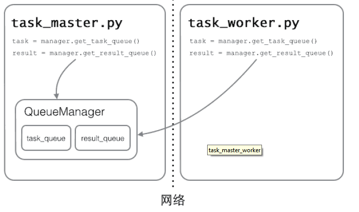

## 多线程
多任务可以由多进程完成，也可以由一个进程内的多线程完成。

我们前面提到了进程是由若干线程组成的，一个进程至少有一个线程。

由于线程是操作系统直接支持的执行单元，因此，高级语言通常都内置多线程的支持，Python也不例外，并且，Python的线程是真正的Posix Thread，而不是模拟出来的线程。

Python的标准库提供了两个模块：`_thread`和`threading`，_thread是`低级模块`，threading是`高级模块`，对_thread进行了封装。绝大多数情况下，我们只需要使用threading这个高级模块。

启动一个线程就是把一个函数传入并创建`Thread实例`，然后调用`start()`开始执行：

```python
#!/usr/bin/env python
# -*- coding: utf-8 -*-
"""
created on 2019/5/11
@user: Keekuun
功能描述:
    开启多线程
"""

import time, threading


# 新线程执行的代码:
def loop():
    print('thread %s is running...' % threading.current_thread().name)
    n = 0
    while n < 5:
        n = n + 1
        print('thread %s >>> %s' % (threading.current_thread().name, n))
        time.sleep(1)
    print('thread %s ended.' % threading.current_thread().name)


if __name__ == '__main__':
    print('thread %s is running...' % threading.current_thread().name)
    t = threading.Thread(target=loop, name='LoopThread')
    t.start()
    t.join()
    print('thread %s ended.' % threading.current_thread().name)

```
console结果：
```shell
thread MainThread is running...
thread LoopThread is running...
thread LoopThread >>> 1
thread LoopThread >>> 2
thread LoopThread >>> 3
thread LoopThread >>> 4
thread LoopThread >>> 5
thread LoopThread ended.
thread MainThread ended.
```
由于任何进程默认就会启动一个线程，我们把该线程称为`主线程`，主线程又可以启动新的线程，Python的`threading模块`有个`current_thread()`函数，它永远返回当前线程的实例。`主线程`实例的名字叫`MainThread`，`子线程`的名字在创建时指定，我们用LoopThread命名子线程。名字仅仅在打印时用来显示，完全没有其他意义，如果不起名字Python就自动给线程命名为Thread-1，Thread-2……

我们把前面下载文件的例子用多线程的方式来实现一遍。
```python
from random import randint
from threading import Thread
from time import time, sleep


def download(filename):
    print('开始下载%s...' % filename)
    time_to_download = randint(5, 10)
    sleep(time_to_download)
    print('%s下载完成! 耗费了%d秒' % (filename, time_to_download))


def main():
    start = time()
    t1 = Thread(target=download, args=('Python从入门到精通.pdf',))
    t1.start()
    t2 = Thread(target=download, args=('Peking Hot.avi',))
    t2.start()
    t1.join()
    t2.join()
    end = time()
    print('总共耗费了%.3f秒' % (end - start))


if __name__ == '__main__':
    main()
```
我们可以直接使用`threading模块`的`Thread类`来创建线程，但是我们之前讲过一个非常重要的概念叫`“继承”`，我们可以从已有的类创建新类，因此也可以通过继承Thread类的方式来创建自定义的线程类，然后再创建线程对象并启动线程。代码如下所示。
```python
from random import randint
from threading import Thread
from time import time, sleep


class DownloadTask(Thread):

    def __init__(self, filename):
        super().__init__()
        self._filename = filename

    def run(self):
        print('开始下载%s...' % self._filename)
        time_to_download = randint(5, 10)
        sleep(time_to_download)
        print('%s下载完成! 耗费了%d秒' % (self._filename, time_to_download))


def main():
    start = time()
    t1 = DownloadTask('Python从入门到精通.pdf')
    t1.start()
    t2 = DownloadTask('Peking Hot.avi')
    t2.start()
    t1.join()
    t2.join()
    end = time()
    print('总共耗费了%.2f秒.' % (end - start))


if __name__ == '__main__':
    main()
```

### 线程之间的通信
因为多个线程可以共享进程的内存空间，因此要实现多个线程间的通信相对简单，大家能想到的最直接的办法就是设置一个全局变量，多个线程共享这个全局变量即可。但是当多个线程共享同一个变量（我们通常称之为“资源”）的时候，很有可能产生不可控的结果从而导致程序失效甚至崩溃。如果一个资源被多个线程竞争使用，那么我们通常称之为“临界资源”，对“临界资源”的访问需要加上保护，否则资源会处于“混乱”的状态。下面的例子演示了100个线程向同一个银行账户转账（转入1元钱）的场景，在这个例子中，银行账户就是一个临界资源，在没有保护的情况下我们很有可能会得到错误的结果。
```python
from time import sleep
from threading import Thread


class Account:

    def __init__(self):
        self._balance = 0

    def deposit(self, money):
        # 计算存款后的余额
        new_balance = self._balance + money
        # 模拟受理存款业务需要0.01秒的时间
        sleep(0.01)
        # 修改账户余额
        self._balance = new_balance

    @property
    def balance(self):
        return self._balance


class AddMoneyThread(Thread):

    def __init__(self, account, money):
        super().__init__()
        self._account = account
        self._money = money

    def run(self):
        self._account.deposit(self._money)


def main():
    account = Account()
    threads = []
    # 创建100个存款的线程向同一个账户中存钱
    for _ in range(100):
        t = AddMoneyThread(account, 1)
        threads.append(t)
        t.start()
    # 等所有存款的线程都执行完毕
    for t in threads:
        t.join()
    print('账户余额为: ￥%d元' % account.balance)


if __name__ == '__main__':
    main()
```
console结果：
```shell
账户余额为: ￥2元
```
运行上面的程序，结果让人大跌眼镜，100个线程分别向账户中转入1元钱，结果居然远远小于100元。之所以出现这种情况是因为我们没有对银行账户这个“临界资源”加以保护，多个线程同时向账户中存钱时，会一起执行到`new_balance = self._balance + money`这行代码，多个线程得到的账户余额都是初始状态下的0，所以都是0上面做了+1的操作，因此得到了错误的结果。在这种情况下，`“锁”`就可以派上用场了。我们可以通过“锁”来保护`“临界资源”`，只有获得“锁”的线程才能访问“临界资源”，而其他没有得到“锁”的线程只能被阻塞起来，直到获得“锁”的线程释放了“锁”，其他线程才有机会获得“锁”，进而访问被保护的“临界资源”。
## LCOK

下面的代码演示了如何使用“锁”来保护对银行账户的操作，从而获得正确的结果。

```python
#!/usr/bin/env python
# -*- coding: utf-8 -*-
"""
created on 2019/5/11
@user: Keekuun
功能描述
"""

from time import sleep
from threading import Thread, Lock


class Account(object):

    def __init__(self):
        self._balance = 0
        self._lock = Lock()

    def deposit(self, money):
        # 先获取锁才能执行后续的代码
        self._lock.acquire()
        try:
            new_balance = self._balance + money
            sleep(0.01)
            self._balance = new_balance
        finally:
            # 在finally中执行释放锁的操作保证正常异常锁都能释放
            self._lock.release()

    @property
    def balance(self):
        return self._balance


class AddMoneyThread(Thread):

    def __init__(self, account, money):
        super().__init__()
        self._account = account
        self._money = money

    def run(self):
        self._account.deposit(self._money)


def main():
    account = Account()
    threads = []
    for _ in range(100):
        t = AddMoneyThread(account, 1)
        threads.append(t)
        t.start()
    for t in threads:
        t.join()
    print('账户余额为: ￥%d元' % account.balance)


if __name__ == '__main__':
    main()

```
console结果：
```shell
账户余额为: ￥100元
```
由于锁只有一个，无论多少线程，同一时刻最多只有一个线程持有该锁，所以，不会造成修改的冲突。创建一个锁就是通过`threading.Lock()`来实现。当多个线程同时执行`lock.acquire()`时，只有一个线程能成功地获取锁，然后继续执行代码，其他线程就继续等待直到获得锁为止。
获得锁的线程用完后一定要释放锁，否则那些苦苦等待锁的线程将永远等待下去，成为死线程。所以我们用`try...finally`来确保锁一定会被释放。

锁的好处就是确保了某段关键代码只能由一个线程从头到尾完整地执行，坏处当然也很多，首先是阻止了多线程并发执行，包含锁的某段代码实际上只能以单线程模式执行，效率就大大地下降了。其次，由于可以存在多个锁，不同的线程持有不同的锁，并试图获取对方持有的锁时，可能会造成死锁，导致多个线程全部挂起，既不能执行，也无法结束，只能靠操作系统强制终止。

比较遗憾的一件事情是Python的多线程并不能发挥CPU的多核特性，这一点只要启动几个执行死循环的线程就可以得到证实了。之所以如此，是因为Python的解释器有一个`“全局解释器锁”（GIL）`的东西，任何线程执行前必须先获得GIL锁，然后每执行100条字节码，解释器就自动释放GIL锁，让别的线程有机会执行，这是一个历史遗留问题，但是即便如此，就如我们之前举的例子，使用多线程在提升执行效率和改善用户体验方面仍然是有积极意义的。

不过，也不用过于担心，Python虽然不能利用多线程实现多核任务，但可以通过多进程实现多核任务。多个Python进程有各自独立的GIL锁，互不影响。

### ThreadLocal
在多线程环境下，每个线程都有自己的数据。一个线程使用自己的局部变量比使用全局变量好，因为局部变量只有线程自己能看见，不会影响其他线程，而全局变量的修改必须加锁。但是局部变量也有问题，就是在函数调用的时候，传递起来很麻烦：
```python
def process_student(name):
    std = Student(name)
    # std是局部变量，但是每个函数都要用它，因此必须传进去：
    do_task_1(std)
    do_task_2(std)

def do_task_1(std):
    do_subtask_1(std)
    do_subtask_2(std)
    def do_task_2(std):
    do_subtask_2(std)
    do_subtask_2(std)
```
每个函数一层一层调用都这么传参数那还得了？用全局变量？也不行，因为每个线程处理不同的Student对象，不能共享。

如果用一个全局dict存放所有的Student对象，然后以thread自身作为key获得线程对应的Student对象如何？

````python
global_dict = {}
def std_thread(name):
    std = Student(name)
    # 把std放到全局变量global_dict中：
    global_dict[threading.current_thread()] = std
    do_task_1()
    do_task_2()
def do_task_1():
    # 不传入std，而是根据当前线程查找：
    std = global_dict[threading.current_thread()]
    ...
def do_task_2():
    # 任何函数都可以查找出当前线程的std变量：
    std = global_dict[threading.current_thread()]
    ...
````

这种方式理论上是可行的，它最大的优点是消除了std对象在每层函数中的传递问题，但是，每个函数获取std的代码有点丑。

有没有更简单的方式？

ThreadLocal应运而生，不用查找dict，ThreadLocal帮你自动做这件事：
```python
import threading

# 创建全局ThreadLocal对象:
local_school = threading.local()

def process_student():
    # 获取当前线程关联的student:
    std = local_school.student
    
    print('Hello, %s (in %s)' % (std, threading.current_thread().name))
def process_thread(name):
    # 绑定ThreadLocal的student:
    local_school.student = name
    process_student()
    
t1 = threading.Thread(target= process_thread, args=('Alice',), name='Thread-A')
t2 = threading.Thread(target= process_thread, args=('Bob',), name='Thread-B')
t1.start()
t2.start()
t1.join()
t2.join()
```

console结果：
```shell
Hello, Alice (in Thread-A)
Hello, Bob (in Thread-B)
```

全局变量local_school就是一个ThreadLocal对象，每个Thread对它都可以读写student属性，但互不影响。你可以把local_school看成全局变量，但每个属性如local_school.student都是线程的局部变量，可以任意读写而互不干扰，也不用管理锁的问题，ThreadLocal内部会处理。

可以理解为全局变量local_school是一个dict，不但可以用local_school.student，还可以绑定其他变量，如local_school.teacher等等。

ThreadLocal最常用的地方就是为每个线程绑定一个数据库连接，HTTP请求，用户身份信息等，这样一个线程的所有调用到的处理函数都可以非常方便地访问这些资源。

>一个ThreadLocal变量虽然是全局变量，但每个线程都只能读写自己线程的独立副本，互不干扰。ThreadLocal解决了参数在一个线程中各个函数之间互相传递的问题。

### 进程 VS 线程

无论是多进程还是多线程，只要数量一多，效率肯定上不去，为什么呢？我们打个比方，假设你不幸正在准备中考，每天晚上需要做语文、数学、英语、物理、化学这5科的作业，每项作业耗时1小时。如果你先花1小时做语文作业，做完了，再花1小时做数学作业，这样，依次全部做完，一共花5小时，这种方式称为单任务模型。如果你打算切换到多任务模型，可以先做1分钟语文，再切换到数学作业，做1分钟，再切换到英语，以此类推，只要切换速度足够快，这种方式就和单核CPU执行多任务是一样的了，以旁观者的角度来看，你就正在同时写5科作业。

但是，切换作业是有代价的，比如从语文切到数学，要先收拾桌子上的语文书本、钢笔（这叫保存现场），然后，打开数学课本、找出圆规直尺（这叫准备新环境），才能开始做数学作业。操作系统在切换进程或者线程时也是一样的，它需要先保存当前执行的现场环境（CPU寄存器状态、内存页等），然后，把新任务的执行环境准备好（恢复上次的寄存器状态，切换内存页等），才能开始执行。这个切换过程虽然很快，但是也需要耗费时间。如果有几千个任务同时进行，操作系统可能就主要忙着切换任务，根本没有多少时间去执行任务了，这种情况最常见的就是硬盘狂响，点窗口无反应，系统处于假死状态。所以，多任务一旦多到一个限度，反而会使得系统性能急剧下降，最终导致所有任务都做不好。

是否采用多任务的第二个考虑是任务的类型，可以把任务分为计算密集型和I/O密集型。计算密集型任务的特点是要进行大量的计算，消耗CPU资源，比如对视频进行编码解码或者格式转换等等，这种任务全靠CPU的运算能力，虽然也可以用多任务完成，但是任务越多，花在任务切换的时间就越多，CPU执行任务的效率就越低。计算密集型任务由于主要消耗CPU资源，这类任务用Python这样的脚本语言去执行效率通常很低，最能胜任这类任务的是C语言，我们之前提到了Python中有嵌入C/C++代码的机制。

除了计算密集型任务，其他的涉及到网络、存储介质I/O的任务都可以视为I/O密集型任务，这类任务的特点是CPU消耗很少，任务的大部分时间都在等待I/O操作完成（因为I/O的速度远远低于CPU和内存的速度）。对于I/O密集型任务，如果启动多任务，就可以减少I/O等待时间从而让CPU高效率的运转。有一大类的任务都属于I/O密集型任务，这其中包括了我们很快会涉及到的网络应用和Web应用。

> 参考：[廖雪峰官方网站的《Python教程》](https://www.liaoxuefeng.com/wiki/1016959663602400)

### 分布式进程
在Thread和Process中，应当优选Process，因为Process更稳定，而且，Process可以分布到多台机器上，而Thread最多只能分布到同一台机器的多个CPU上。
Python的multiprocessing模块不但支持多进程，其中managers子模块还支持把多进程分布到多台机器上。一个服务进程可以作为调度者，将任务分布到其他多个进程中，依靠网络通信。由于managers模块封装很好，不必了解网络通信的细节，就可以很容易地编写分布式多进程程序。

举个例子：如果我们已经有一个通过Queue通信的多进程程序在同一台机器上运行，现在，由于处理任务的进程任务繁重，希望把发送任务的进程和处理任务的进程分布到两台机器上。怎么用分布式进程实现？

原有的Queue可以继续使用，但是，通过managers模块把Queue通过网络暴露出去，就可以让其他机器的进程访问Queue了。

我们先看服务进程，服务进程负责启动Queue，把Queue注册到网络上，然后往Queue里面写入任务：

task_master.py
```python
#!/usr/bin/env python
# -*- coding: utf-8 -*-
"""
created on 2019/5/11
@user: Keekuun
功能描述:
    master分配任务：发布任务，求n的平方
"""

# !/usr/bin/env python3
# -*- coding: utf-8 -*-

import random, time, queue
from multiprocessing.managers import BaseManager

# 发送任务的队列:
task_queue = queue.Queue()
# 接收结果的队列:
result_queue = queue.Queue()


# 自定义函数get_task_queue
def get_task_queue():
    global task_queue
    return task_queue


# 自定义函数get_result_queue
def get_result_queue():
    global result_queue
    return result_queue


# 从BaseManager继承的QueueManager:
class QueueManager(BaseManager):
    pass


if __name__ == '__main__':

    # 把两个Queue都注册到网络上, callable参数关联了Queue对象:
    QueueManager.register('get_task_queue', callable=get_task_queue)
    QueueManager.register('get_result_queue', callable=get_result_queue)

    # 绑定端口5000, 设置验证码'abc':
    manager = QueueManager(address=('127.0.0.1', 5000), authkey=b'hello world')

    # 启动Queue:
    manager.start()

    # 获得通过网络访问的Queue对象:
    task = manager.get_task_queue()
    result = manager.get_result_queue()

    # 放几个任务进去:
    for i in range(10):
        n = random.randint(0, 10000)
        print('Put task %d...' % n)
        task.put(n)

    # 从result队列读取结果:
    print('Try get results...')
    for i in range(10):
        r = result.get(timeout=10)
        print('Result: %s' % r)

    # 关闭:
    manager.shutdown()
    print('master exit.')
```

task_worker.py
```python
#!/usr/bin/env python
# -*- coding: utf-8 -*-
"""
created on 2019/5/11
@user: Keekuun
功能描述
    worker处理任务：接收任务，计算n的平方
"""

import time, sys, queue
from multiprocessing.managers import BaseManager


# 创建类似的QueueManager:
class QueueManager(BaseManager):
    pass


if __name__ == '__main__':
    # 由于这个QueueManager只从网络上获取Queue，所以注册时只提供名字:
    QueueManager.register('get_task_queue')
    QueueManager.register('get_result_queue')

    # 连接到服务器，也就是运行task_master.py的机器:
    server_addr = '127.0.0.1'
    print('Connect to server %s...' % server_addr)

    # 端口和验证码注意保持与task_master.py设置的完全一致:
    m = QueueManager(address=(server_addr, 5000), authkey=b'hello world')

    # 从网络连接:
    m.connect()

    # 获取Queue的对象:
    task = m.get_task_queue()
    result = m.get_result_queue()

    # 从task队列取任务,并把结果写入result队列:
    for i in range(10):
        try:
            n = task.get(timeout=1)
            print('run task %d * %d...' % (n, n))
            r = '%d * %d = %d' % (n, n, n * n)
            time.sleep(1)
            result.put(r)
        except queue.Empty:
            print('task queue is empty.')

    # 处理结束:
    print('worker exit.')
```
master运行：
```shell

Put task 2732...
Put task 1122...
Put task 6716...
Put task 1176...
Put task 901...
Put task 6783...
Put task 2898...
Put task 645...
Put task 3554...
Put task 8800...
Try get results...
Result: 2732 * 2732 = 7463824
Result: 1122 * 1122 = 1258884
Result: 6716 * 6716 = 45104656
Result: 1176 * 1176 = 1382976
Result: 901 * 901 = 811801
Result: 6783 * 6783 = 46009089
Result: 2898 * 2898 = 8398404
Result: 645 * 645 = 416025
Result: 3554 * 3554 = 12630916
Result: 8800 * 8800 = 77440000
master exit.
```

worker运行：
```shell
Connect to server 127.0.0.1...
run task 2732 * 2732...
run task 1122 * 1122...
run task 6716 * 6716...
run task 1176 * 1176...
run task 901 * 901...
run task 6783 * 6783...
run task 2898 * 2898...
run task 645 * 645...
run task 3554 * 3554...
run task 8800 * 8800...
worker exit.
```

这个简单的`Master/Worker模型`有什么用？其实这就是一个简单但真正的分布式计算，把代码稍加改造，启动多个worker，就可以把任务分布到几台甚至几十台机器上，比如把计算n*n的代码换成发送邮件，就实现了邮件队列的异步发送。

Queue对象存储在哪？注意到task_worker.py中根本没有创建Queue的代码，所以，Queue对象存储在task_master.py进程中：



而Queue之所以能通过网络访问，就是通过QueueManager实现的。由于QueueManager管理的不止一个Queue，所以，要给每个Queue的网络调用接口起个名字，比如get_task_queue。

authkey有什么用？这是为了保证两台机器正常通信，不被其他机器恶意干扰。如果task_worker.py的authkey和task_master.py的authkey不一致，肯定连接不上。

>Python的分布式进程接口简单，封装良好，适合需要把繁重任务分布到多台机器的环境下。
注意Queue的作用是用来传递任务和接收结果，每个任务的描述数据量要尽量小。比如发送一个处理日志文件的任务，就不要发送几百兆的日志文件本身，而是发送日志文件存放的完整路径，由Worker进程再去共享的磁盘上读取文件。