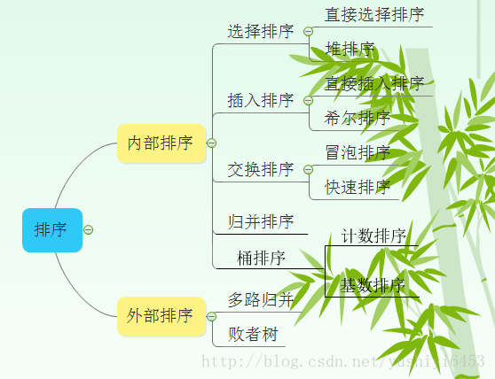
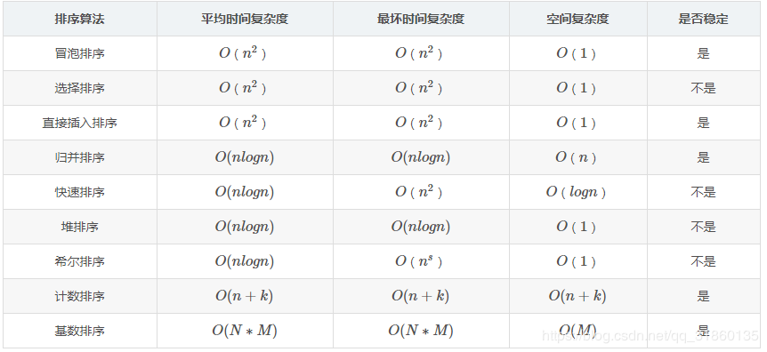
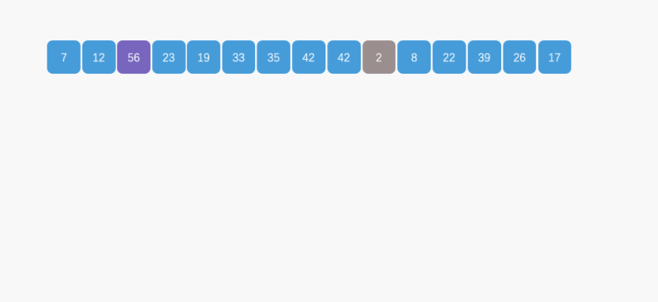

# Python3 实现十大经典排序算法

## 算法分类


## 算法比较


## 术语说明
- 稳定：如果a原本在b前面，而a=b，排序之后a仍然在b的前面；
- 不稳定：如果a原本在b的前面，而a=b，排序之后a可能会出现在b的后面；
- 内排序：所有排序操作都在内存中完成；
- 外排序：由于数据太大，因此把数据放在磁盘中，而排序通过磁盘和内存的数据传输才能进行；
- [时间复杂度](https://blog.csdn.net/qq_41523096/article/details/82142747)： 一个算法执行所耗费的时间。
- 空间复杂度：运行完一个程序所需内存的大小。

## 1.选择排序（Selection Sort）

+ 选择排序（Selection Sort）:
    - 选择排序(Selection-sort)是一种简单直观的排序算法。它的工作原理：首先在未排序序列中找到最小（大）元素，存放到排序序列的
起始位置，然后，再从剩余未排序元素中继续寻找最小（大）元素，然后放到已排序序列的末尾。以此类推，直到所有元素均排序完毕。

+ 算法描述:

    - n个记录的直接选择排序可经过n-1趟直接选择排序得到有序结果。具体算法描述如下：
        - 1.初始状态：无序区为R[1..n]，有序区为空；
        - 2.第i趟排序(i=1,2,3…n-1)开始时，当前有序区和无序区分别为R[1..i-1]和R(i..n）。该趟排序从当前无序区中-选出关键字最
    小的记录 R[k]，将它与无序区的第1个记录R交换，使R[1..i]和R[i+1..n)分别变为记录个数增加1个的新有序区和记录个数减少1个的
    新无序区；
        - 3.n-1趟结束，数组有序化了。
+ 算法演示


+ 算法实现       
```python
def select_sort(data):
    """
    :param data: list
    :return: sorted data
    """

    length = len(data)
    if length < 2:
        return data

    for i in range(length - 1):
        # 最小值的索引
        minIndex = i
        for j in range(i + 1, length):
            # 找到最小值的索引
            if (data[j] < data[minIndex]):
                minIndex = j
            # 将最小的值放在i处
            data[i], data[minIndex] = data[minIndex], data[i]
        # print(data)
    return data
```

## 2.冒泡排序（Bubble Sort）
+ 冒泡排序（Bubble Sort）：
    - 冒泡排序是一种简单的排序算法。它重复地走访过要排序的数列，一次比较两个元素，如果它们的顺序错误就把它们交换过来。走访数
    列的工作是重复地进行直到没有再需要交换，也就是说该数列已经排序完成。这个算法的名字由来是因为越小的元素会经由交换慢慢“浮”
    到数列的顶端。
+ 算法描述:
    - 1.比较相邻的元素。如果第一个比第二个大，就交换它们两个；
    - 2.对每一对相邻元素作同样的工作，从开始第一对到结尾的最后一对，这样在最后的元素应该会是最大的数；
    - 3.针对所有的元素重复以上的步骤，除了最后一个；
    - 4.重复步骤1~3，直到排序完成。
+ 算法演示


+ 算法实现
```python
def bubble_sort(data):
    """
    :param data: list
    :return: sorted data
    """

    length = len(data)
    if length < 2:
        return data

    for i in range(length - 1):
        for j in range(length - 1 - i):
            if (data[j + 1] < data[j]):
                data[j], data[j + 1] = data[j + 1], data[j]
        # print(data)
    return data
```
## 3.插入排序（Insertion Sort）
+ 插入排序（Insertion Sort）：
    - 插入排序（Insertion-Sort）的算法描述是一种简单直观的排序算法。它的工作原理是通过构建有序序列，对于未排序数据，在已排序
    序列中从后向前扫描，找到相应位置并插入。插入排序在实现上，通常采用in-place排序（即只需用到O(1)的额外空间的排序），因而
    在从后向前扫描过程中，需要反复把已排序元素逐步向后挪位，为最新元素提供插入空间。
+ 算法描述：
    - 一般来说，插入排序都采用in-place在数组上实现。具体算法描述如下：
        - 1.从第一个元素开始，该元素可以认为已经被排序；
        - 2.取出下一个元素，在已经排序的元素序列中从后向前扫描；
        - 3.如果该元素（已排序）大于新元素，将该元素移到下一位置；
        - 4.重复步骤3，直到找到已排序的元素小于或者等于新元素的位置；
        - 5.将新元素插入到该位置后；
        - 6.重复步骤2~5。
+ 算法演示


+ 算法实现
```python
def insert_sort(data):
    """
    :param data:list
    :return: sorted data
    """
    length = len(data)
    if length < 2:
        return data

    for i in range(0, length - 1):
        preIndex = i
        current = data[i + 1]
        while preIndex >= 0 and current < data[preIndex]:
            # 增加空间
            data[preIndex + 1] = data[preIndex]
            preIndex -= 1
        data[preIndex + 1] = current
        # print(data)
    return data

```

## 4.希尔排序（Shell Sort）
+ 希尔排序（Shell Sort）:
    - 希尔排序是希尔（Donald Shell）于1959年提出的一种排序算法。希尔排序也是一种插入排序，它是简单插入排序经过改进之后的一个
    更高效的版本，也称为缩小增量排序，同时该算法是冲破O(n2）的第一批算法之一。它与插入排序的不同之处在于，它会优先比较距离较远
    的元素。希尔排序又叫缩小增量排序。希尔排序是把记录按下表的一定增量分组，对每组使用直接插入排序算法排序；随着增量逐渐减少，
    每组包含的关键词越来越多，当增量减至1时，整个文件恰被分成一组，算法便终止。
+ 算法描述:
    - 我们来看下希尔排序的基本步骤，在此我们选择增量gap=length/2，缩小增量继续以gap = gap/2的方式，这种增量选择我们可以用一
    个序列来表示，{n/2,(n/2)/2...1}，称为增量序列。希尔排序的增量序列的选择与证明是个数学难题，我们选择的这个增量序列是比较常
    用的，也是希尔建议的增量，称为希尔增量，但其实这个增量序列不是最优的。此处我们做示例使用希尔增量。先将整个待排序的记录序列
    分割成为若干子序列分别进行直接插入排序，具体算法描述：选择一个增量序列t1，t2，…，tk，其中ti>tj，tk=1；按增量序列个数k，对
    序列进行k 趟排序；每趟排序，根据对应的增量ti，将待排序列分割成若干长度为m 的子序列，分别对各子表进行直接插入排序。仅增量因
    子为1 时，整个序列作为一个表来处理，表长度即为整个序列的长度。
+ 算法演示


+ 算法实现
```python
def shell_sort(data):
    """
    :param data: list
    :return: sorted data
    """
    length = len(data)
    if length < 2:
        return data

    step = length // 2
    while step > 0:
        for i in range(step, length):
            while i >= step and data[i - step] > data[i]:
                data[i - step], data[i] = data[i], data[i - step]
                i -= step
        # print(data)
        step = step // 2
    return data
```

## 5.归并排序（Merge Sort）
+ 归并排序（Merge Sort）:
    - 归并排序是建立在归并操作上的一种有效的排序算法。该算法是采用分治法（Divide and Conquer）的一个非常典型的应用。将已有序
    的子序列合并，得到完全有序的序列；即先使每个子序列有序，再使子序列段间有序。若将两个有序表合并成一个有序表，称为2-路归并。

+ 算法描述:
    - 1.把长度为n的输入序列分成两个长度为n/2的子序列；
    - 2.对这两个子序列分别采用归并排序；
    - 3.将两个排序好的子序列合并成一个最终的排序序列。
    
+ 算法演示


+ 算法实现
```python
def merge_sort(data):
    """
    :param data: list
    :return: sorted data
    """
    length = len(data)
    if length < 2:
        return data
    mid = length // 2
    # 分别对两个子列表并归排序
    merge_left = merge_sort(data[:mid])
    merge_right = merge_sort(data[mid:])

    def merge(data_left, data_right):
        # print(data_left, data_right)
        """
        合并(将两个有序的列表合并成一个有序的列表)
        :param data_left: data[:mid]
        :param data_right:data[mid:]
        :return: sorted data
        """
        left, right = 0, 0
        len_left = len(data_left)
        len_right = len(data_right)
        sorted_data = []
        while left < len_left and right < len_right:
            if data_left[left] < data_right[right]:
                sorted_data.append(data_left[left])
                left += 1
            else:
                sorted_data.append(data_right[right])
                right += 1
        sorted_data += data_left[left:]
        sorted_data += data_right[right:]
        return sorted_data

    # 合并(将两个有序的列表合并成一个有序的列表)
    return merge(merge_left, merge_right)
```

## 6.快速排序（Quick Sort）
+ 快速排序（Quick Sort）:
   - 快速排序的基本思想：通过一趟排序将待排记录分隔成独立的两部分，其中一部分记录的关键字均比另一部分的关键字小，则可
    分别对这两部分记录继续进行排序，以达到整个序列有序。
    
+ 算法描述:
    - 快速排序使用分治法来把一个串（list）分为两个子串（sub-lists）。具体算法描述如下：
        - 1.从数列中挑出一个元素，称为 “基准”（pivot）；
        - 2.重新排序数列，所有元素比基准值小的摆放在基准前面，所有元素比基准值大的摆在基准的后面（相同的数可以到任一
        边）。在这个分区退出之后，该基准就处于数列的中间位置。这个称为分区（partition）操作；
        - 3.递归地（recursive）把小于基准值元素的子数列和大于基准值元素的子数列排序。

+ 算法演示


+ 算法实现
```python
def quick_sort(data):
    """
    :param data:list
    :return:sorted data
    """
    length = len(data)
    if length < 2:
        return data

    # 随机基准
    import random
    index = random.randint(0, length - 1)

    left = [l for l in data[index + 1:] + data[0:index] if l <= data[index]]
    right = [r for r in data[index + 1:] + data[0:index] if r > data[index]]
    #  有序数据 = 基准左侧  + 基准 + 基准右侧
    return quick_sort(left) + [data[index]] + quick_sort(right)

```
>快速排序，一行代码实现(为了方便查阅，用了换行)
```python
one_quick_sort = (lambda array: array if len(array) <= 1 else
    one_quick_sort([item for item in array[1:] if item <= array[0]]) +  # 小于基准
    [array[0]] +                                                        # 等于基准
    one_quick_sort([item for item in array[1:] if item > array[0]]))    # 大于基准
```
## 7.堆排序（Heap Sort）
+ 堆排序（Heap Sort）:
    - 堆排序（Heapsort）是指利用堆这种数据结构所设计的一种排序算法。堆积是一个近似完全二叉树的结构，并同时满足堆积的性
质：即子结点的键值或索引总是小于（或者大于）它的父节点。
+ 算法描述:
    - 1.将初始待排序关键字序列(R1,R2….Rn)构建成大顶堆，此堆为初始的无序区；
    - 2.将堆顶元素R1与最后一个元素Rn交换，此时得到新的无序区(R1,R2,……Rn-1)和新的有序区(Rn),且满足R[1,2…n-1]<=Rn；
    - 3.由于交换后新的堆顶R1可能违反堆的性质，因此需要对当前无序区(R1,R2,……Rn-1)调整为新堆，然后再次将R1与无序区最
后一个元素交换，得到新的无序区(R1,R2….Rn-2)和新的有序区(Rn-1,Rn)。不断重复此过程直到有序区的元素个数为n-1，则整个
排序过程完成。

+ 算法演示


+ 算法实现
```python
def heap_sort(data):
    """
    :param data:list
    :return:sorted data
    """

    length = len(data)
    if length < 2:
        return data

    def adjustHeap(i):
        """调整使之成为最大堆"""
        maxIndex = i
        if i * 2 < length and data[i * 2] > data[maxIndex]:
            maxIndex = i * 2
        if i * 2 + 1 < length and data[i * 2 + 1] > data[maxIndex]:
            maxIndex = i * 2 + 1
        if maxIndex != i:
            data[maxIndex], data[i] = data[i], data[maxIndex]
            adjustHeap(maxIndex)

    def buildMaxHeap():
        """建立最大堆"""
        # 从最后一个非叶子节点开始向上构造最大堆
        i = (length - 1) // 2
        while i >= 0:
            adjustHeap(i)
            i -= 1

    # 构建一个最大堆
    buildMaxHeap()

    # 循环将堆首位（最大值）与末位交换，然后再重新调整最大堆
    while length > 0:
        data[0], data[length - 1] = data[length - 1], data[0]
        length -= 1
        adjustHeap(0)
        # print(data)
    return data

```

## 8.计数排序（Counting Sort）
+ 计数排序（Counting Sort）:
    - 计数排序的核心在于将输入的数据值转化为键存储在额外开辟的数组空间中。 作为一种线性时间复杂度的排序，计数排序要求
输入的数据必须是有确定范围的整数。计数排序(Counting sort)是一种稳定的排序算法。计数排序使用一个额外的数组C，其中第i
个元素是待排序数组A中值等于i的元素的个数。然后根据数组C来将A中的元素排到正确的位置。它只能对整数进行排序。

+ 算法描述:
    - 1.找出待排序的数组中最大和最小的元素；
    - 2.统计数组中每个值为i的元素出现的次数，存入数组C的第i项；(i必须为正整数)
    - 3.对所有的计数累加（从C中的第一个元素开始，每一项和前一项相加）；
    - 4.反向填充目标数组：将每个元素i放在新数组的第C(i)项，每放一个元素就将C(i)减去1。

+ 算法演示


+ 算法实现
```python
def count_sort(data):
    """
    :param data:list
    :return:sorted data
    """
    length = len(data)
    if length < 2:
        return data

    # 数组C,None表示当前位置没有记录数据信息
    C = [None] * (max(data) - min(data) + 1)

    # 将计数信息存入C数组中
    for i in range(length):
        C[data[i] - min(data)] += 1
    # print(C)

    # 从C数组中按序取出数值并返回
    sorted_data = []
    for index, value in enumerate(C):
        # 判断当前位置是否记录有信息
        if value is not None:
            sorted_data += [index + min(data)] * value
    return sorted_data
```

## 9.桶排序（Bucket Sort）
+ 桶排序（Bucket Sort）:
    - 桶排序是计数排序的升级版。它利用了函数的映射关系，高效与否的关键就在于这个映射函数的确定。
    - 桶排序 (Bucket sort)的工作的原理：假设输入数据服从均匀分布，将数据分到有限数量的桶里，每个桶再分别排序（有可能再
使用别的排序算法或是以递归方式继续使用桶排序进行排序。

+ 算法描述：
    - 1.人为设置一个BucketSize，作为每个桶所能放置多少个不同数值（例如当BucketSize==5时，该桶可以存放｛1,2,3,4,5｝这几
种数字，但是容量不限，即可以存放100个3）；
    - 2.遍历输入数据，并且把数据一个一个放到对应的桶里去；
    - 3.对每个不是空的桶进行排序，可以使用其它排序方法，也可以递归使用桶排序；
    - 4.从不是空的桶里把排好序的数据拼接起来。
    
+ 算法演示


+ 算法实现
```python
def bucket_sort(data, num=10):
    """
    :param data:list
    :param num:bucket num
    :return:sorted data
    """
    length = len(data)
    if length < 2:
        return data

    min_value = min(data)
    max_value = max(data)

    import re
    pattern = r'^[1-9]+[0-9]*$'
    # 桶的数量，如果不匹配默认取10
    num = num if num > 1 and re.match(pattern, str(num)) else 10
    # 桶的空间
    space = int((max_value - min_value) / num) + 1
    # 初始化桶空间,注意:[[]] * num生成list的坑,两者append方法结果不同
    buckets = [[] for _ in range(num)]

    # 将数据放到对应的桶里面,难点:数据与桶的映射关系
    for i in range(length):
        # 数据与桶的映射关系
        index = int((data[i] - min_value) / space)
        # print(data[i], index)
        buckets[index].append(data[i])
        # print(buckets)

    # 桶内数据排序
    # for n in buckets:
    #     print(n)
    #     n.sort()

    # 按序取出桶内的数据，组成有序序列
    sorted_data = []
    for n in buckets:
        n.sort()
        sorted_data += n
    return sorted_data
```

## 10.基数排序（Radix Sort）
+ 基数排序（Radix Sort）:
    - 基数排序也是非比较的排序算法，对每一位进行排序，从最低位开始排序，复杂度为O(kn),为数组长度，k为数组中的数的最大
    的位数；基数排序是按照低位先排序，然后收集；再按照高位排序，然后再收集；依次类推，直到最高位。有时候有些属性是有
    优先级顺序的，先按低优先级排序，再按高优先级排序。最后的次序就是高优先级高的在前，高优先级相同的低优先级高的在
    前。基数排序基于分别排序，分别收集，所以是稳定的。
+ 算法描述:
    - 1.取得数组中的最大数，并取得位数；
    - 2.arr为原始数组，从最低位开始取每个位组成radix数组；
    - 3.对radix进行计数排序（利用计数排序适用于小范围数的特点）；
+ 基数排序有两种方法：
    - 1.MSD 从高位开始进行排序
    - 2.LSD 从低位开始进行排序

+ 基数排序 vs 计数排序 vs 桶排序
   + 这三种排序算法都利用了桶的概念，但对桶的使用方法上有明显差异：
        - 基数排序：根据键值的每位数字来分配桶
        - 计数排序：每个桶只存储单一键值
        - 桶排序：每个桶存储一定范围的数值
        
+ 算法演示


+ 算法实现
````python
def radix_sort(data):
    """
    :param data:list
    :return:sorted data
    """

    length = len(data)
    if length < 2:
        return data
    # 最大位数
    max_value = max(data)
    max_digit = str(max_value).__len__()

    # 将数据按照个位、十位、百位。。。上的数字放到对应编号的桶里
    for i in range(max_digit):
        # 初始化桶，因为每个位置数范围0-9，故初始化10个桶
        buckets = [[] for _ in range(10)]
        for d in data:
            index = int(d / (10 ** i) % 10)
            buckets[index].append(d)
        # 从桶中按序取出数据放回原数组
        data = [d for b in buckets for d in b]
        print(data)
    return data
````

## 后话
其实Python有自带的排序函数,实现十大经典排序，一方面提高Python语言熟练度，另一方面锻炼自己的思维。
```python
# 一句话搞定的事儿，何必呢。。。孔乙己：你知道“回”有多少种写法吗。。。
print(sorted(data))
```
>本文动图来自网络，感谢网友们的分享。