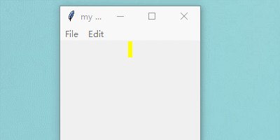
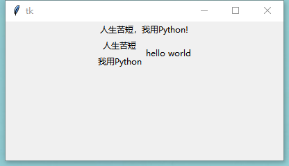

# 图形用户界面和游戏开发

## 基于tkinter模块的GUI
GUI是图形用户界面的缩写，图形化的用户界面对使用过计算机的人来说应该都不陌生，在此也无需进行赘述。Python默认的GUI开发模块是`tkinter`（在Python 3以前的版本中名为Tkinter），从这个名字就可以看出它是基于Tk的，Tk是一个工具包，最初是为Tcl设计的，后来被移植到很多其他的脚本语言中，它提供了`跨平台`的GUI控件。当然Tk并不是最新和最好的选择，也没有功能特别强大的GUI控件，事实上，开发GUI应用并不是Python最擅长的工作，如果真的需要使用Python开发GUI应用，`wxPython`、`PyQt`、`PyGTK`等模块都是不错的选择。
基本上使用tkinter来开发GUI应用需要以下5个步骤：
1. 导入tkinter模块中我们需要的东西。
2. 创建一个顶层窗口对象并用它来承载整个GUI应用。
3. 在顶层窗口对象上添加GUI组件。
4. 通过代码将这些GUI组件的功能组织起来。
5. 进入主事件循环(main loop)。

学习资料：
- [An Introduction To Tkinter](http://effbot.org/tkinterbook/tkinter-index.htm)
- [莫烦Python3 tkinter视频教程](https://morvanzhou.github.io/tutorials/python-basic/tkinter/)

### tkinter简单介绍
Tkinter 是使用 python 进行窗口视窗设计的模块. 简单的构造, 多平台, 多系统的兼容性, 能让它成为让你快速入门定制窗口文件的好助手. 它在 python 窗口视窗模块中是一款简单型的. 所以用来入门, 熟悉 窗口视窗的使用, 非常有必要.

### Label & Button部件
```python
import tkinter as tk

window = tk.Tk()
window.title('窗口标题')
window.geometry('400x200')

# 定义变量并设置默认值
text = tk.StringVar(value='hello')

# 文本标签
label = tk.Label(
    window,
    textvariable=text,   # 使用 textvariable(变量) 替换 text(定值),
    bg='#ccc',           # 背景色
    font=('Arial', 12),  # 字体及大小
    width=15,            # 标签宽度
    height=2             # 标签高度
)

label.pack()


# 判断点击事件，切换文本
flag = True


# 定义点击事件
def click():
    global flag
    if flag:
        text.set('you click me!')
        flag = False
    else:
        text.set('hello world!')
        flag = True


# 按钮
button = tk.Button(
    window,
    text='click',
    bg='#f60',
    font=('Arial', 12),
    width=15,
    height=2,
    command=click   # 绑定点击事件
)
button.pack()

# 开启窗口
window.mainloop()

```

### Entry & Text部件
```python
import tkinter as tk

window = tk.Tk()
window.title('窗口标题')
window.geometry('400x200')

# 创建一个文本框用于输入，内容以“*”显示
e = tk.Entry(window, show='*')
e.pack()

# 定义点击事件
def insert_point():
    text = e.get()
    t.insert('insert', text)  # 插入到光标出


def insert_end():
    text = e.get()
    t.insert('end', text)   # 插入到最后


# 按钮
b1 = tk.Button(
    window,
    text='insert point',
    width=15,
    height=2,
    command=insert_point  # 绑定点击事件
)
b1.pack()

b2 = tk.Button(
    window,
    text='insert end',
    width=15,
    height=2,
    command=insert_end  # 绑定点击事件
)
b2.pack()

# 创建一个文本框用于显示、输入
t = tk.Text(window, height=2)
t.pack()

# 开启窗口
window.mainloop()

```

### Listbox部件
```python
import tkinter as tk

root = tk.Tk()

root.title('list box')
root.geometry('400x200')

# 创建一个label用于显示
labelvar = tk.StringVar(value='人生苦短，我用Python')
l = tk.Label(root, bg='green', textvariable=labelvar)
l.pack()


# 定义点击事件
def print_selection():
    # 获取当前选中的文本
    curselection = lb.get(lb.curselection())
    # 显示当前选中的文本
    labelvar.set(curselection)


# 按钮绑定事件
b = tk.Button(root, text='print selection', command=print_selection)
b.pack()

listvar = tk.StringVar(value=['list box', 'hello world', '人生苦短，我用Python'])
# list box选择框
lb = tk.Listbox(root, listvariable=listvar)
lb.pack()

if __name__ == '__main__':
    root.mainloop()

```


### Radiobutton部件

```python
import tkinter as tk

root = tk.Tk()

root.title('list box')
root.geometry('400x200')

l = tk.Label(root, bg='yellow', width=20, text='empty')
l.pack()


def print_selection():
    l.config(text='you have selected ' + radiovar.get())


item = [('option A', 'A'), ('option B', 'B'), ('option C', 'C'),
        ('option D', 'D'), ('option E', 'E')]
radiovar = tk.StringVar()
for text, value in item:
    tk.Radiobutton(
        root,
        text=text,
        value=value,
        variable=radiovar,
        command=print_selection
    ).pack()

radiovar.set('B')

if __name__ == '__main__':
    root.mainloop()

```

### Scale部件
```python
s = tk.Scale(window, 
              label='try me', 
              from_=5, 
              to=11, 
              orient=tk.HORIZONTAL,
              length=200, 
              showvalue=0, 
              tickinterval=2, 
              resolution=0.01, 
              command=print_selection
)
s.pack()
```
这里的参数`label`是指scale部件的名称，即在这里scale部件名称为try me
- 参数`from_`=5，`to`=11的意思就是从5到11，即这个滚动条最小值为5，最大值为11（这里使用`from_`是因为在python中有`from`这个`关键词`）
参数`orient=tk.HORIZONTAL`在这里就是设置`滚动条的方向`，如我们所看到的效果图，这里HORIZONTAL就是`横向`。
- 参数`length`这里是指滚动条部件的`长度`，但注意的是和其他部件`width`表示不同，width表示的是以`字符`为单位，比如width=4，就是4个字符的长度，而此处的length=200，是指我们常用的`像素`为单位，即长度为`200个像素`
- 参数`resolution=0.01`这里表示保留几位小数，此处的0.01就是保留2位小数，如果保留一位就是`resolution=0.1`,这里的`showvalue`就是设置在滚动条上方的显示。
- 参数`tickinterval`设置的就是`坐标的间隔`，此处为`tickinterval=2`，显示的即为效果图中的`5.00 7.00 9.00 11.00`,如果改为tickinterval=3则为5.00 8.00 11.00

```python
import tkinter as tk

root = tk.Tk()
root.title('Scale')
root.geometry('400x200')

l = tk.Label(root, bg='green', text='hello')
l.pack()

def scale(v):
    l.config(text='you have drag me to ' + v)
s=tk.Scale(
    root,
    label='drag me',
    from_=1,
    to=15,
    orient=tk.HORIZONTAL,
    length=400,
    showvalue=1,
    tickinterval=2,
    resolution=0.01,
    command=scale
).pack()
if __name__ == '__main__':
    root.mainloop()

```


### Checkbutton部件
```python
var1 = tk.IntVar()
c1 = tk.Checkbutton(window, text='Python', variable=var1, onvalue=1, offvalue=0,
                    command=print_selection)
c1.pack()
```
参数`onvalue`和前面讲的部件`radiobutton`中的value相似， 当我们选中了这个`checkbutton`，onvalue的值`1`就会放入到`var1`中， 然后`var1`将其赋值给参数`variable`，`offvalue`用法相似，但是offvalue是在没有选中这个checkbutton时，offvalue的值1放入var1，然后赋值给参数variable 这是创建一个checkbutton部件，以此类推，可以创建多个checkbutton
```python
import tkinter as tk

root = tk.Tk()
root.title('my window')
root.geometry('200x200')

l = tk.Label(root, bg='yellow', width=20, text='empty')
l.pack()


def print_selection():
    if (var1.get() == 1) & (var2.get() == 0):
        l.config(text='I love only Python ')
    elif (var1.get() == 0) & (var2.get() == 1):
        l.config(text='I love only C++')
    elif (var1.get() == 0) & (var2.get() == 0):
        l.config(text='I do not love either')
    else:
        l.config(text='I love both')


var1 = tk.IntVar()
var2 = tk.IntVar()
c1 = tk.Checkbutton(root, text='Python', variable=var1, onvalue=1, offvalue=0,
                    command=print_selection)
c2 = tk.Checkbutton(root, text='C++', variable=var2, onvalue=1, offvalue=0,
                    command=print_selection)
c1.pack()
c2.pack()
if __name__ == '__main__':
    root.mainloop()

```


### Canvas部件
```python
canvas = tk.Canvas(window, bg='blue', height=100, width=200)
canvas.pack()
image_file = tk.PhotoImage(file='ins.gif')
image = canvas.create_image(10, 10, anchor='nw', image=image_file)

```
这里的代码主要是实现小图片。 `image_file = tk.PhotoImage(file='ins.gif')`这一句是创造一个变量存放ins.gif这张图片。 `image = canvas.create_image(10, 10, anchor='nw', image=image_file)`里面的参数10,10就是图片放入画布的坐标， 而这里的`anchor=nw`则是把图片的左上角作为锚定点，在加上刚刚给的坐标位置，即可将图片位置确定。 最后一个参数的意思大家应该都知道，就是将刚刚存入的图片变量，赋值给image。

```python
x0, y0, x1, y1= 50, 50, 80, 80
line = canvas.create_line(x0, y0, x1, y1)
```
这段代码主要实现的是画一条直线，后面()中给的参数就是线段两点的坐标，两点确定`一条直线`。此处给的就是从坐标`(50,50)`到`(80,80)`画一条直线。

```python
oval = canvas.create_oval(x0, y0, x1, y1, fill='red')  #创建一个圆，填充色为`red`红色
arc = canvas.create_arc(x0+30, y0+30, x1+30, y1+30, start=0, extent=180)  #创建一个扇形
rect = canvas.create_rectangle(100, 30, 100+20, 30+20)   #创建一个矩形
```
这里面就是创建扇形时多了两个没见过的参数`start=0`和`extent=180`，其实就是从`0度`到`180度`，就好像扇子的边打开一样。在我们看来就是个半圆， 如果改为`extent=90`，我们看到的就是一个`1/4圆`

```python
import tkinter as tk

window = tk.Tk()
window.title('my window')
window.geometry('200x200')

canvas = tk.Canvas(window, bg='blue', height=100, width=200)
image_file = tk.PhotoImage(file='ins.gif')
image = canvas.create_image(10, 10, anchor='nw', image=image_file)
x0, y0, x1, y1 = 50, 50, 80, 80
line = canvas.create_line(x0, y0, x1, y1)
oval = canvas.create_oval(x0, y0, x1, y1, fill='red')
arc = canvas.create_arc(x0 + 30, y0 + 30, x1 + 30, y1 + 30, start=0, extent=180)
rect = canvas.create_rectangle(100, 30, 100 + 20, 30 + 20)
canvas.pack()


def moveit():
    canvas.move(rect, 0, 2)


b = tk.Button(window, text='move', command=moveit).pack()

if __name__ == '__main__':
    window.mainloop()

```


### Menu部件
下面是我们制作整个菜单栏的流程, 我们先需要加入一个 Menubar 作为整体框架, 然后再在 Menubar 中加一些部件。

1. 创建一个菜单栏，这里我们可以把他理解成一个容器，在窗口的上方
    ```python
    menubar = tk.Menu(window)
    ```

2. 定义一个空菜单单元
    ```python
    filemenu = tk.Menu(menubar, tearoff=0)
    ```

3. 将上面定义的空菜单命名为`File`，放在菜单栏中，就是装入那个容器中
    ```python
    menubar.add_cascade(label='File', menu=filemenu)
    ```

4. 在`File`中加入`New`的小菜单，即我们平时看到的下拉菜单，每一个小菜单对应命令操作。如果点击这些单元, 就会触发`do_job`的功能
    ```python
    filemenu.add_command(label='New', command=do_job)
    filemenu.add_command(label='Open', command=do_job)##同样的在`File`中加入`Open`小菜单
    filemenu.add_command(label='Save', command=do_job)##同样的在`File`中加入`Save`小菜单
    
    filemenu.add_separator()##这里就是一条分割线
    
    ```
5. 同样的在`File`中加入`Exit`小菜单,此处对应命令为`window.quit`
    ```python
    filemenu.add_command(label='Exit', command=window.quit)
    
    ``` 
同样的我们在定义另一个菜单Edit也是如此和定义的File菜单一样 这里再来看一下效果中比较不一样的菜单就是File中的Import菜单, 在这个菜单选项中, 我们还能分支出更多的选项.
```python
submenu = tk.Menu(filemenu) ##和上面定义菜单一样，不过此处是在`File`上创建一个空的菜单
filemenu.add_cascade(label='Import', menu=submenu, underline=0) ##给放入的菜单`submenu`命名为`Import`
submenu.add_command(label="Submenu1", command=do_job) ##这里和上面也一样，在`Import`中加入一个小菜单命令`Submenu1`
```

```python
import tkinter as tk

window = tk.Tk()
window.title('my window')
window.geometry('200x200')

l = tk.Label(window, text='', bg='yellow')
l.pack()
counter = 0


def do_job():
    global counter
    l.config(text='do ' + str(counter))
    counter += 1


menubar = tk.Menu(window)
filemenu = tk.Menu(menubar, tearoff=0)
menubar.add_cascade(label='File', menu=filemenu)
filemenu.add_command(label='New', command=do_job)
filemenu.add_command(label='Open', command=do_job)
filemenu.add_command(label='Save', command=do_job)
filemenu.add_separator()
filemenu.add_command(label='Exit', command=window.quit)

editmenu = tk.Menu(menubar, tearoff=0)
menubar.add_cascade(label='Edit', menu=editmenu)
editmenu.add_command(label='Cut', command=do_job)
editmenu.add_command(label='Copy', command=do_job)
editmenu.add_command(label='Paste', command=do_job)

submenu = tk.Menu(filemenu)
filemenu.add_cascade(label='Import', menu=submenu, underline=0)
submenu.add_command(label="Submenu1", command=do_job)

window.config(menu=menubar)

if __name__ == '__main__':
    window.mainloop()

```

### Frame部件
`Frame` 是一个在 Windows 上分离小区域的部件, 它能将 Windows 分成`不同的区`,然后存放不同的其他部件. 同时一个 Frame 上也能再分成两个 Frame, Frame 可以认为是`一种容器`。如果你学过前端，那么自然可以想到这个部件类似于`<frame>标签`。
1. 定义一个`label`显示`on the window`
    ```python
    tk.Label(window, text='on the window').pack()
    ```
2. 在`window`上创建一个`frame`
    ```python
    frm = tk.Frame(window)
    frm.pack()
    ```
3. 在刚刚创建的`frame`上创建两个`frame`，我们可以把它理解成一个大容器里套了一个小容器，即`frm`上有两个`frame` ，`frm_l`和`frm_r`
    ```python
    frm_l = tk.Frame(frm)
    frm_r = tk.Frame(frm)
    ```
4. 这里是控制小的`frm`部件在大的`frm`的相对位置，此处`frm_l`就是在`frm`的左边，`frm_r`在`frm`的右边
    ```python
    frm_l.pack(side='left')
    frm_r.pack(side='right')
    ```
5. 这里的三个label就是在我们创建的frame上定义的label部件，还是以容器理解，就是容器上贴了标签，来指明这个是什么，解释这个容器。
    ```python
    tk.Label(frm_l, text='on the frm_l1').pack()##这个`label`长在`frm_l`上，显示为`on the frm_l1`
    tk.Label(frm_l, text='on the frm_l2').pack()##这个`label`长在`frm_l`上，显示为`on the frm_l2`
    tk.Label(frm_r, text='on the frm_r1').pack()##这个`label`长在`frm_r`上，显示为`on the frm_r1`
    ```
```python
import tkinter as tk

root = tk.Tk()
root.geometry('400x200')

# 定义一个label显示
tk.Label(root, text='人生苦短，我用Python!').pack()

# 创建一个'frame'
frm = tk.Frame(root)
frm.pack()

# 在`frm`中再创建两个'frame'，即大容器包小容器
frm_left = tk.Frame(frm)
frm_right = tk.Frame(frm)

# 设置小容器的位置
frm_left.pack(side='left')
frm_right.pack(side='right')

# 显示的内容
tk.Label(frm_left, text='人生苦短').pack()
tk.Label(frm_right, text='hello world').pack()
tk.Label(frm_left, text='我用Python').pack()

if __name__ == '__main__':
    root.mainloop()

```


### Messagebox部件
其实这里的`messagebox`就是我们平时看到的弹窗。 我们首先需要定义一个触发功能，来触发这个弹窗 这里我们就放上以前学过的button按钮
```python
tk.Button(window, text='hit me', command=hit_me).pack()
```
通过触发功能，调用messagebox
```python
def hit_me():
   tk.messagebox.showinfo(title='Hi', message='hello world')
```
对话框类型：
```python
tk.messagebox.showinfo(title='',message='') #提示信息对话窗
tk.messagebox.showwarning() #提出警告对话窗
tk.messagebox.showerror()   #提出错误对话窗
tk.messagebox.askquestion() #询问选择对话窗
```

```python
import tkinter as tk
from tkinter import messagebox

root = tk.Tk()

root.geometry('400x200')


def click():
    tk.messagebox.showinfo(title='Hello World!', message='人生苦短，我用Python!')


tk.Button(root, text='Say Hi', command=click).pack()

if __name__ == '__main__':
    root.mainloop()
    print(tk.messagebox.askquestion())  # 返回yes和no
    print(tk.messagebox.askokcancel())  # 返回true和false
    print(tk.messagebox.askyesno())  # 返回true和false
    print(tk.messagebox.askretrycancel())  # 返回true和false
```

### pack、grid、place定位部件
#### pack
首先我们先看看我们常用的`.pack()`, 他会按照上下左右的方式排列.
```python
tk.Label(root, text='1').pack(side='top')     #上
tk.Label(root, text='1').pack(side='bottom')  #下
tk.Label(root, text='1').pack(side='left')    #左
tk.Label(root, text='1').pack(side='right')   #右
```

#### grid
接下里我们在看看`.grid()`, grid 是方格, 所以所有的内容会被放在这些规律的方格中.
```python
for i in range(4):
    for j in range(3):
        tk.Label(root, text=1).grid(row=i, column=j, padx=10, pady=10)
```
以上的代码就是创建一个`四行三列`的表格，其实grid就是用表格的形式定位的。这里的参数 `row为行`，`colum为列`，`padx`就是单元格`左右间距`，`pady`就是单元格`上下间距`。

#### place
再接下来就是`place()`, 这个比较容易理解，就是给精确的坐标来定位，如此处给的`（20,10）`，就是将这个部件放在坐标为`（x，y）`的这个位置 后面的参数`anchor=nw`就是前面所讲的锚定点是`西北角`。
```python
tk.Label(window, text=1).place(x=20, y=10, anchor='nw')
```


exercise python 100 days from  https://github.com/jackfrued/Python-100-Days
